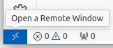
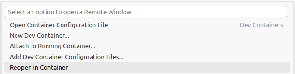

# Hello VAF Demo

This `Hello, World!` style demo, introduces to the Vehicle Application Framework (VAF) with a simple
example. The figure below provides a schematic illustration to give an overview of its building
blocks:


`AppModule1` provides a communication interface that is used by `AppModule2`.

The first application module periodically sends a message of format `Hello, VAF! - MsgID: <ID>`
to the second application module. The second module subscribes to message changes and prints new
messages on the terminal. It uses an operation to periodically change the MsgID of the first
application module, which is part of the message above.

## Prerequisites

### Docker setup
All steps in this tutorial are executed from within a container. Recipe and build script for the
appropriate VAF image are provided in the [Container](../../Container/README.md) folder of this
project repository.

Execute `docker images` to check if a REPOSITORY named `vaf` with TAG `latest` is available in the
list before moving on to the next steps.

### Workspace
The Vehicle Application Framework (VAF) supports three different project types, *interface project*,
*app-module project*, and *integration project*. These project types are useful for the organization
of small and large projects but especially helpful, when working with distributed development teams.

To group projects that belong together, it is recommended to create a so-called *workspace*. This
parent folder contains for example a devcontainer file to facilitate the work with VS Code.

To create a workspace, navigate to the target location, then use the below command to start a VAF
container and finally, create a VAF workspace there and enter the new directory.
``` bash
cd <some-dir>
docker run -it --rm --network=host -v$PWD:$PWD -w$PWD vaf:latest /bin/bash

vaf workspace init
Enter your workspace name: VafWorkspace

cd VafWorkspace
```

The following steps of the tutorial can either be executed in this already open terminal window or
directly from VS Code as described below.

### VS Code setup
To work with the VS Code container extension, enter a VAF workspace directory and make sure to
re-open the folder in the container:

* Open a remote window (bottom-left corner)



* Re-open project in container


  
In the bottom-left corner you find also a task runner extension that supports with the individual
steps of the VAF workflow. Commands can be clicked instead of using the command line interface. 

>**ℹ️ Note**  
> The execution path gets derived from the current working directory based on the currently opened
> file in editor area of the IDE.

## Project setup

First step is to create an integration project. This type of project deals with the integration of
an application, which includes instantiation and wiring of application modules, configuration of the
executable(s), and finally, the build of the binaries for execution on the target machine.
Application module projects can either be created in place, i.e., as sub-project of an integration
project, or imported from some external location. For the sake of simplicity, this demo makes use of
the first option.

First step is to create the required projects by using the following CLI commands:

``` bash
vaf project init integration
Enter your project name: HelloVaf
? Enter the directory to store your project in .

cd HelloVaf

vaf project create app-module
Enter the name of the app-module: AppModule1
Enter the namespace of the app-module: demo
? Enter the path to the project root directory .

vaf project create app-module
Enter the name of the app-module: AppModule2
Enter the namespace of the app-module: demo
? Enter the path to the project root directory .
```

The above commands create the structure of the corresponding projects. The application module
sub-projects are stored in the `HelloVaf/src/application_modules` directory, i.e., directly in the
integration project.

## Definition of interfaces

Communication between application modules is defined by means of communication interfaces. The
Configuration as Code (CaC) file for this step is part of the project template and located in the
`model` folder of each app-module sub-project. Extend the `app_module1.py` file of the first
app-module located in `HelloVaf/src/application_modules/app_module1/model` as follows:

``` python
interface = vafpy.ModuleInterface(name="HelloWorldIf", namespace="demo")
interface.add_data_element("Message", datatype=BaseTypes.STRING)
interface.add_operation("SetMsgId", in_parameter={"MsgId": BaseTypes.UINT8_T})
```

This snippet defines a simple interface containing one data element (`Message`) and one operation
(`SetMsgId`).

As this interface definition is also used by the other app-module, make sure to copy the above
definition to the corresponding CaC file of the second app-module.

## Configuration of application modules

Next step is the configuration of both app-modules. For `AppModule1`, modify the generated template
of the CaC file to add a provider instance of the above interface and a periodically executed task:

``` python
app_module1.add_provided_interface("HelloWorldProvider", interface)

periodic_task = vafpy.Task(name="PeriodicTask", period=timedelta(milliseconds=500))
app_module1.add_task(task=periodic_task)
```

The configuration snippet for `AppModule2` is almost similar. Only the interface instance is a
consumed one in this case:

``` python
app_module2.add_consumed_interface("HelloWorldConsumer", interface)

periodic_task = vafpy.Task(name="PeriodicTask", period=timedelta(milliseconds=1000))
app_module2.add_task(task=periodic_task)
```

With this, the Configuration as Code part is complete. Next step is to start the code generation for
both app-modules. Change to the appropriate project directories
`HelloVaf/src/application_modules/app_module1` and `HelloVaf/src/application_modules/app_module2` to
run:

``` bash
vaf project generate
```

This step provides the implementation stubs in the `implementation` subdirectory of the app-module
projects. It also configures CMake with a release and debug preset to enable support by the VS Code
CMake Tools extension as well as IntelliSense features.

## Implementation of business logic
Now, some business logic can be added according to the demo description in the introduction of this
tutorial. For that, the periodic tasks of both app-modules need to be implemented. Further, an
operation handler needs to be registered in `AppModule1`. In `AppModule2` a data element handler is
needed.

In the first app-module, add the following snippet to the constructor 
(see `HelloVaf/src/application_modules/app_module1/implementation/src/app_module1.cpp`):

``` cpp
HelloWorldProvider_->RegisterOperationHandler_SetMsgId(
  [this](const std::uint8_t& msg_id) { msg_id_ = static_cast<uint8_t>(msg_id); }
);
```

Next, extend the periodic task with a simple method:

``` cpp
std::string myMsg = "Hello, VAF! - MsgID: " + std::to_string(msg_id_);
HelloWorldProvider_->Set_Message(myMsg.c_str());
```

Additionally, a member attribute must be defined in the corresponding header file of AppModule1:

``` cpp
 private:
  uint8_t msg_id_;
```

In the constructor of the second app-module, register a data element handler as follows:

``` cpp
HelloWorldConsumer_->RegisterDataElementHandler_Message(
  GetName(),
  [](const auto& hello_text) { std::cout << "Received: " << *hello_text << std::endl; }
);
```

Further, modify the periodic task to include the following snippet:

``` cpp
static uint8_t msg_id = 0;
HelloWorldConsumer_->SetMsgId(msg_id++);
```

Also, extend the include directives, for example with `#include <iostream>` in `app_module2.cpp`.

>**ℹ️ Note**  
> To check for compilation errors, you can compile the app-modules into static libraries using `vaf
> make build` inside of the app-module project directory.

## Executable configuration

Returning to the integration project, both application modules can now be instantiated. Those
instances are then mapped to some executable, and finally, connected among each other. First,
however, the model changes from the application module projects above must be updated as to be
present on the level of the integration project. To do so, run the following command from the 
integration projects' root directory, i.e. `HelloVaf`:

``` bash
vaf model update
```

Select both application modules in the appearing interactive dialog.

Now, the CaC file of the integration project in `HelloVaf/model/vaf/hello_vaf.py` can be extended:

``` python
# Create executable instances
executable = Executable("HelloVaf")

# Add application modules to executable instances
executable.add_application_module(AppModule1, [(Instances.AppModule1.Tasks.PeriodicTask, timedelta(milliseconds=10), 0)])
executable.add_application_module(AppModule2, [(Instances.AppModule2.Tasks.PeriodicTask, timedelta(milliseconds=10), 1)])
```

The above config snippet adds one instance of each app-module to the `HelloVaf` executable, enables
the periodic tasks, and sets them with a time budget of 10 ms and a preferred execution order.

Next step is the connection of the two application modules:
``` python
# Connect the internal application module instances
executable.connect_interfaces(
    AppModule1,
    Instances.AppModule1.ProvidedInterfaces.HelloWorldProvider,
    AppModule2,
    Instances.AppModule2.ConsumedInterfaces.HelloWorldConsumer,
)
```

Now, the project configuration is complete. The source code on executable-level can be generated
and the executable can be built as listed below:

``` bash
vaf project generate
vaf make install
```

>**ℹ️ Note**  
> If something changes in any sub-project of the integration project, the entire integration project
> with all it's dependencies can be regenerated using `vaf project generate --mode ALL`. This also
> includes the `vaf model update` command as mentioned at the beginning of this section.

## Running the application

After the successful install step, the binary executable is located in the
`HelloVaf/build/<build_type>/install` directory and can be executed from there as follows:

``` bash
cd build/Release/install/opt/HelloVaf/
./bin/HelloVaf
```

You should see the following output on your terminal:

```
UserController::PreInitialize
ExecutableControllerBase::ChangeStateOfModule: name HelloWorldIfModule state: kNotOperational
ExecutableControllerBase::ChangeStateOfModule: name AppModule1 state: kNotOperational
ExecutableControllerBase::ChangeStateOfModule: name AppModule2 state: kNotOperational
UserController::PostInitialize
UserController::PreStart
ExecutableControllerBase::ChangeStateOfModule: name HelloWorldIfModule state: kStarting
ExecutableControllerBase::ChangeStateOfModule: name HelloWorldIfModule state: kOperational
ExecutableControllerBase::ChangeStateOfModule: name AppModule1 state: kStarting
ExecutableControllerBase::ChangeStateOfModule: name AppModule1 state: kOperational
UserController::PostStart
ExecutableControllerBase::ChangeStateOfModule: name AppModule2 state: kStarting
ExecutableControllerBase::ChangeStateOfModule: name AppModule2 state: kOperational
Received: Hello, VAF! - MsgID: 0
Received: Hello, VAF! - MsgID: 0
Received: Hello, VAF! - MsgID: 1
Received: Hello, VAF! - MsgID: 1
Received: Hello, VAF! - MsgID: 2
Received: Hello, VAF! - MsgID: 2
Received: Hello, VAF! - MsgID: 3
...
```

## Introduction to interface projects

In the above example, the interface definition is needed in both application module projects and
had to be copied. This works for small projects but even there, it can easily happen that
definitions diverge from each other. In consequence, consolidation or merging is needed.

To avoid such situations, *interface projects* in the VAF can be used to define communication
interfaces in a central location. Application module projects can then import these interfaces to
the Configuration as Code level for further use.

The following steps illustrate, how an interface project can be added to the above example.
At first, create a new interface project in your workspace, i.e., next to the `HelloVaf` folder:

``` bash
vaf project init interface
Enter your project name: HelloInterfaces
? Enter the directory to store your project in .
```

The interface definitions that earlier got directly added to the configuration in the app-module
projects can now go here. To specify the `HelloWorldIf`, extend the generated `hello_interfaces.py`
file as follows:

``` python
interface = vafpy.ModuleInterface(name="HelloWorldIf", namespace="demo")
interface.add_data_element("Message", datatype=BaseTypes.STRING)
interface.add_operation("SetMsgId", in_parameter={"MsgId": BaseTypes.UINT8_T})
```

Next, generate the corresponding data exchange format of this interface definition:

``` bash
cd HelloInterfaces
vaf model generate
```

Switch to the directory of each application module project and run the following command to import
the interface project. Choose the path to the `HelloInterfaces/export/HelloInterfaces.json` file
in the interactive prompt:

``` bash
vaf project import
```

The original interface definition can now be removed from both app-module configurations. Instead,
the following line must be uncommented:

``` python
from .imported_models import *
```

The interface can now be used through the imported CaC helper as illustrated below:

``` python
app_module1.add_provided_interface("HelloWorldProvider", hello_interfaces.Demo.hello_world_if)
```

Apply those changes for both application modules.

Finally and due to changes in both app-modules, the executable can be rebuilt by navigating to the
integration project directory and running the following commands:

``` bash
vaf project generate --mode ALL
vaf make install
```
