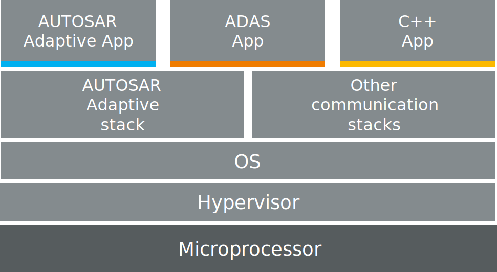
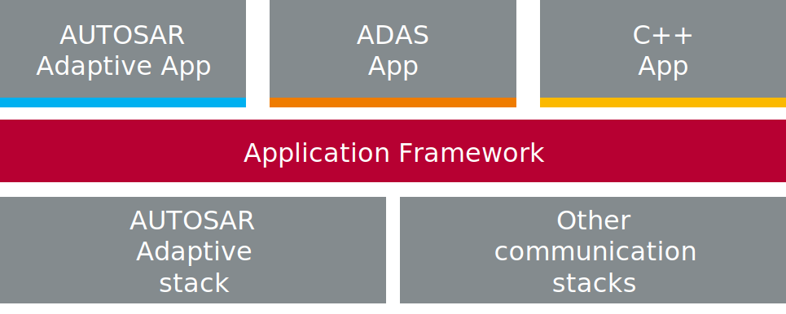

# Introduction

This project addresses application development and integration for µP-based Electronic Control Units
(ECU) in the automotive domain.

The starting point for the project is illustrated by the below stack view on a µP-based ECU. From
bottom to top, hardware gets abstracted by an optional hypervisor but definitely by some POSIX
operating system (OS). Distributed communication is then realized an top and covered by middleware
solutions, for example based on SOME/IP or DDS. The application layer sits on top and directly
interfaces with the services or mechanisms of the lower layer middleware respectively.

 

For applications that get developed according to the AUTOSAR Adaptive standard, the middleware stack
and its ara::com interface is given. The model-driven workflow related to the solution, however,
comes with extensive front loading. All details need to be modeled, which makes it difficult to
implement agile work modes in bigger projects at the side of an OEM or Tier-1. Architecture and
modeling work is often separated from the development teams, which makes efficient and constructive
collaboration a difficult endeavor.

Another group of applications is based on graphical engineering and development tools. Modeling in
graphical UML tools as well as GUI-supported development (for example in MATLAB Simulink) cover the
development and test journey to a large extent. Integration with a middleware stack below, instead,
is often cumbersome and far from straight-forward. Also tool lock-in is a problem. Applications or
algorithms that once got developed and tested in such an environment are hard to migrate to
different eco-systems. This keeps especially the suppliers in the automotive field from reaching
their goal, namely *Software as a product*. In other words, applications that are developed in a
middleware-agnostic way and ready to be sold, no matter what middleware stack is running in the
target system.

The last application type represents code-first development. That is, algorithms and logic that is
developed irrespective of automotive standards and independent of commercial tools. This modern
approach comes natural to engineers and computer scientists without automotive background.
Programming language skills and an IDE with helpful plugins is all they need. When starting in
automotive projects, this target group is confronted with automotive-specific terms and APIs for
established communication patters as for example pub-sub messaging or remote procedure calls.

In sum, different workflows, patterns, file formats and models exist. The complete field of
application development for high-performance machines in the automotive sector is extremely dynamic.
Terms that are used all over the place are linked with varying definitions. Even the term
*Application* has different meaning for different people, which makes discussions on the topic
troublesome and fruitless. In the end, integration of software building blocks and especially the
reuse are complicated. Productivity decreases, integration in and migration to series projects
remains a hard task.

 

This situation in mind lead to the idea of an *Application Framework* and finally to this project.
The concept can be shortly summarized as follows: Plan is to introduce a new, thin, modeled and
generated layer to the µP stack that also comes with a complete workflow and corresponding tool to
work with it. This way, lower-layer independent design, implementation, and test of distributed
applications shall become easier and more straight-forward for either of the above-mentioned target
groups.
