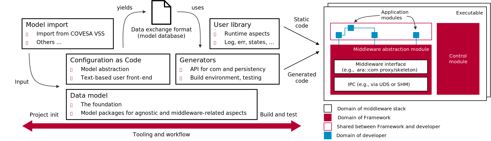

**Table of contents**  
[1. SW architecture](21_sw_architecture.md)  
[2. Workflow](22_workflow.md)  
[3. Model](23_model.md)  
[4. API](24_api.md)  
[5. Configuration](25_configuration.md)  
[6. Platform support](26_platform_support.md)  
[7. Code generation](27_code_generation.md)  
[8. SW library](28_sw_library.md)  
[9. Testing](29_testing.md)  

# Building blocks

The *Application Framework* is a compile-time solution that puts the focus on the executable. The
essential building blocks of the framework are illustrated below. The workflow covers all steps,
from project creation over modeling and configuration, import of design artifacts, generation,
build, and test. The software architecture on executable-level is completely modular as illustrated
on the right-hand side. Generated and static code artifacts that are provided by the framework go
hand in hand with code that is added or integrated by the developer in the scope of so-called
application modules.

> **The definition of *Application* in this project is clear and unambiguous:**  
> An *Application* is of distributed kind and considered a thematic bracket. On technical level it
> can consist of 1..N executables. Each executable in turn can consist of 1..M application modules.
