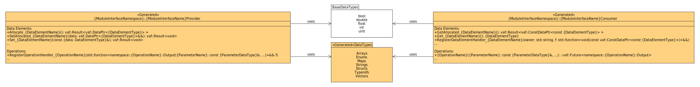
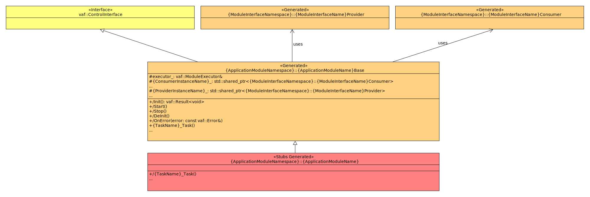
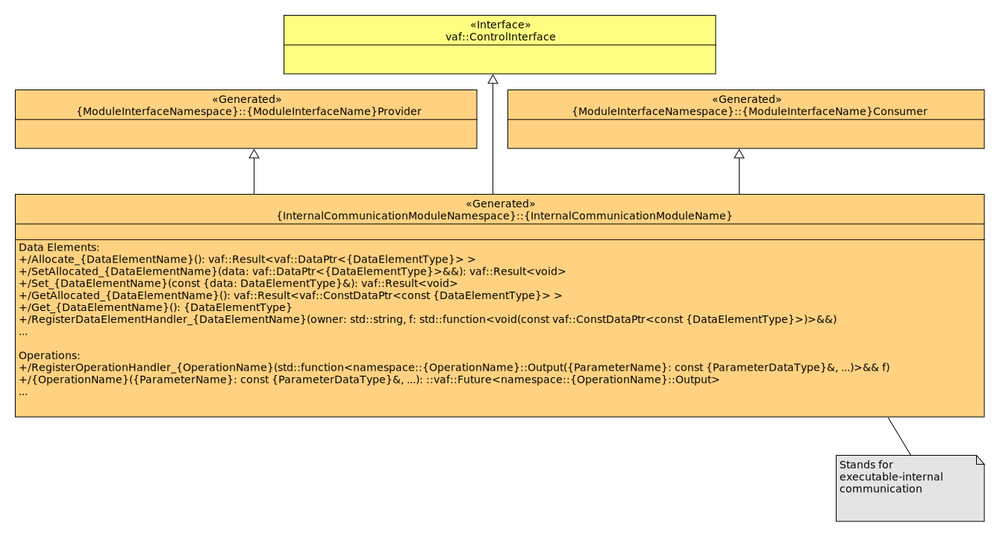
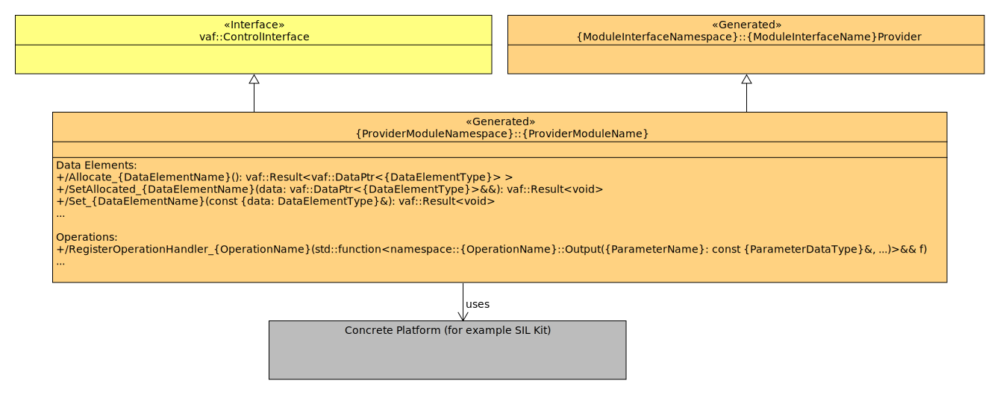
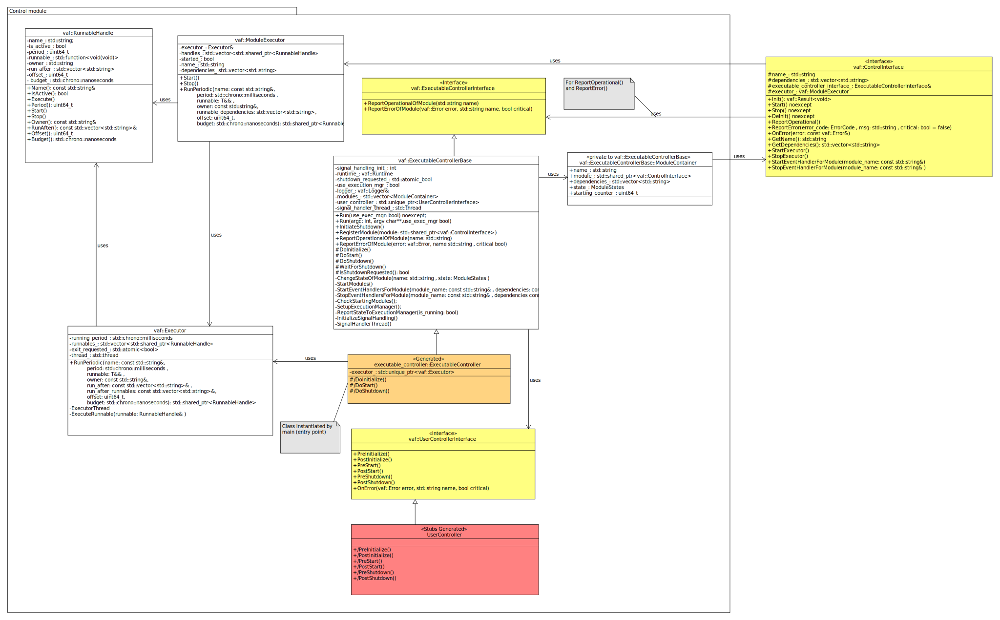

# Software architecture

The following subsection describes the software architecture on executable-level as implemented by the Vehicle Application Framework (VAF).

A VAF executable consists of application modules whose tasks are orchestrated by the VAF control
module. Each application module can access platform and internal communication provider and consumer
modules to handle communication with the outside world of the application module. The communication
contract between an application module and a communication module - either platform or internal
communication - is defined by a module interface. This ensures a clean separation between
application modules and communication modules, be it platform or internal communication.

The individual components are described in more detail below.

## Module interface

A module interface is a communication contract between application modules and respective deployable
communication modules. A concrete module consists of a set of DataElements and a set of Operations.
Here, a DataElement is used to exchange data that is modeled by a datatype, whereby the datatype can
be either a basic type or a modeled complex type. Operations, on the other hand, provide the
communication pattern of a remote procedure call. Here too, both the return value and the parameters
of the procedure call can be either a basic type or modeled as complex type. Each module interface
belongs to one of the following categories. It is either a *Consumer* interface, i.e., it consumes
data elements and operations, or it is a *Provider* interface, i.e., it provides data elements and
operations.  
Depending on the consumer or provider role, the module interface contains corresponding API
methods for each DataElement and each Operation of a module interface. These API methods are
described in more detail in the [VAF API](24_api.md) section.

The overall structure of consumer and provider module interfaces is given below:
 

## Application module

An application module is the place where the user's business logic is to be implemented. Interaction
between application modules and the *outside world* takes place via consumer and provider
communication modules. There exist two flavors of the those modules, internal communication modules
and platform-related modules. The application module itself is separated into a base class and a
specialization. The specialization contains pre-generated method stubs that a software developer can
implement. Helper comments are generated to those stubs as to guide users of the framework. The base
class is used to hide all aspects that a software developer does not necessarily have to deal with.
For each communication module in use, the base class provides a shared pointer of the respective
module interface type. By that, an application module does not dependent on a concrete communication
module deployment. Concrete deployments instead can be injected on start up via the control module
using the pattern of *dependency injection*. The base class is also derived from the control
interface. Control interface methods are used by the control module to manage and orchestrate the
application modules at startup and during execution.

The overall structure of an application module is given below:
 

## Internal communication module

The internal communication module handles the communication between application modules within one
executable for a given module interface. Both categories, *Consumer* and *Provider* communication,
are implemented by one internal communication module. Thus, the internal communication module class
is a specialization of a provider and consumer module interface. The internal communication module
class is also derived from the control interface. Control interface methods are used by the control
module to manage and orchestrate the internal communication modules at startup and during execution.

The overall structure of an internal communication module is given below:
 

## Platform provider module

The platform provider module handles communication between application modules and a platform
middleware in the role of a *Provider*. The platform provider module class is therefore a
specialization of a provider module interface. It acts as glue for a specific middleware that
uses it, such as SIL Kit for example. The platform provider module class is also derived from the
control interface. Control interface methods are used by the control module to manage and
orchestrate the platform provider modules at startup and during execution.

The overall structure of a platform provider module is given below:
 

## Platform consumer module

The platform consumer module handles communication between application modules and a platform
middleware in the role of *Consumer*. The platform consumer module class is therefore a
specialization of a consumer module interface. It acts as glue code for a specific middleware that
uses it, such as SIL Kit for example. The platform consumer module class is also derived from the
control interface. Control interface methods are used by the control module to manage and
orchestrate the platform consumer modules at startup and during execution.

The overall structure of a platform consumer module is given below:
 

## Control module

The control module is the core component of a VAF executable. It manages the creation of the
contained application and communication modules, their initialization, starting, and stopping. It is
also responsible for the periodic processing of tasks that belong to application modules in an
execution thread. The basis of the control module is the class `ExecutableControllerBase` and its
specialization `ExecutableController`, which is generated according to the given model. The
specialization must be instantiated in a main function and its member method `Run` must be executed.
A corresponding main function is also generated by the VAF code generators and does not have to be
created by the user. The `Run` method triggers the initialization and start of the contained
modules. In addition, a user-implementable call-out, the `UserController`, is triggered in the
initial phase so that a user can add specific code artifacts there.  
The `UserController` is a specialization of the `UserControllerInterface` and a stub is generated
for it, which does not need to be modified if no special need by the user is given. The
specialization `ExecutableController` also contains the `Executor` class, which holds the `Executor
Thread` and manages the periodic processing of the tasks. All tasks of one module are additionally
managed by the class `ModuleExecutor`, inherited via its parent class `ControlInterface`, such that
all tasks of one module can be activated or deactivated together. Within the control module, a task
itself is stored in the class `RunnableHandle`

The overall structure of the control module is given below:
 
