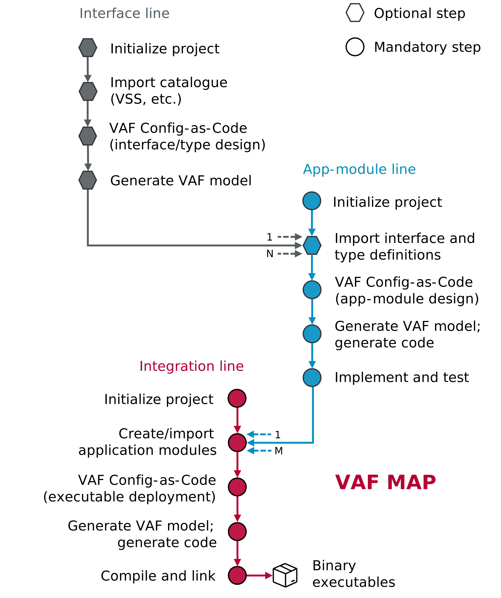

# Workflow (vaf-cli)

According to the introduction, the Vehicle Application Framework (VAF) is not only a layer in the µP
stack but also a tool and associated workflow that facilitates the work with this stack layer.  
The workflow can be divided in three parts, each one represented by a specific project type. The
below figure illustrates the optional and mandatory steps on interface, app-module, and integration
line.

 

The interface project marks the optional starting point. This project type allows the consolidation
of available design artifacts, for example provided in an Interface Description Language (IDL) or a
signal/service catalogue representation. Imported information from there can be modified or extended
by using the Configuration as Code (CaC) solution in Python that comes with the framework. Last step
on this line is the export of created design artifacts to the VAF model data exchange format.

The next line covers design/implementation/test of application modules. Interface definitions can be
imported but not necessarily have to. The complete functionality from the interface line is also
available for the app-module projects. Also here, CaC plays a central role for modeling and
configuration of the application module. Model exchange format creation directly based on that the
code generation step provide the necessary code, build environment, and test files and stubs to
start development and test of the application module.

Final workflow step is the integration of application modules on executable-level. Application
module projects can be imported or created in place. Again CaC is in place as user front-end for
instantiation and mapping in this project type. The flow ends with model plus code generation
followed by compile and link step that eventually produce one or more binaries for execution.

The complete workflow is covered by a command-line tool. Please find a tree representation of all
included commands below.

 
