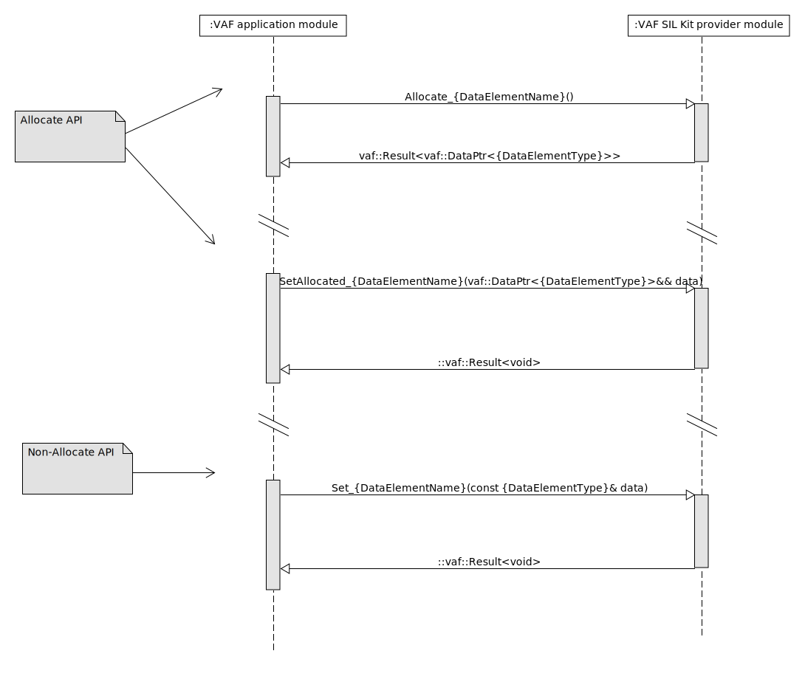
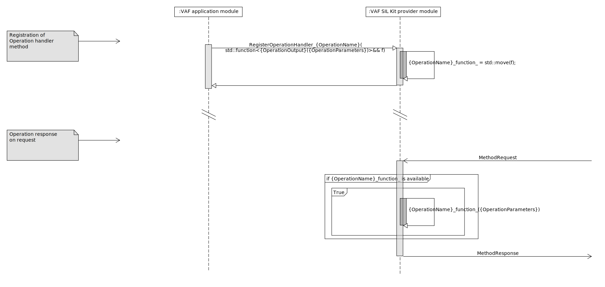

# VAF API

## Communication

In the following, the basic API methods for *data elements* and *operations* of a module interface
are presented in dependence of the role, i.e., consumer or provider.

Each *data element* with name `{DataElementName}` and type `{DataElementType}` of a module interface
of consumer type makes the following interface methods available to the consumer module interface:
``` C++
vaf::Result<vaf::ConstDataPtr<const {DataElementType}>> GetAllocated_{DataElementName}()

{DataElementType} Get_{DataElementName}()

void RegisterDataElementHandler_{DataElementName}(std::string owner, std::function<void(const vaf::ConstDataPtr<const {DataElementType}>)>&& f)
```

`GetAllocated_{DataElementName}()` differs from `Get_{DataElementName}()`. In the former case, a
``vaf::Result`` with a contained `vaf::ConstDataPtr` or a `vaf::Error` is returned if no *data
element* has been received yet. Currently, `vaf::ConstDataPtr` contains a `std::unique_ptr` of
datatype `const {DataElementType}`, but further extensions are easily possible if needed to support
other middlewares. In the latter case, a copy is returned from the Non-Allocatee API if a value is
present, and if no data element has been received yet, a default value is returned.

The associated call sequence is shown below on the example of a SIL Kit consumer module.

When a data element is received, the generic receive handler stores the value of the data element in
`cached_{DataElementName}_` from where it is accessible via a `vaf::ConstDataPtr` of type `
DataElementType`. It also calls the registered *data element* handlers.  
The process of registering the *data element* handlers is shown in (Registration of *data element*
callback handler methods). The process of the respective getters is shown in (Allocate API) and
(Non-Allocate API). 

<br>

On the other hand, each *data element* with name `{DataElementName}` and type `{DataElementType}` of
a module interface of provider type makes the following interface methods available to the provider
module interface:
``` C++
vaf::Result<vaf::DataPtr<{DataElementType}>> Allocate_{DataElementName}()

vaf::Result<void> SetAllocated_{DataElementName}(data: vaf::DataPtr<{DataElementType}>&&)

vaf::Result<void> Set_{DataElementName}(const {data: DataElementType}&)
```

Here, one can distinguish between an *Allocatee API* and a *Non-Allocatee API*. With the Allocatee
API, a `vaf::DataPtr` of a specific datatype must be instantiated first before the actual data value
can be assigned. The `SetAllocated_{DataElementName}()` method then takes the allocated
`vaf::DataPtr` to pass it over to the middleware provider module. The specific middleware module,
again, is then responsible for the processing of the released `vaf::DataPtr`. It can either make a
copy of it and send it out, or, implement a zero-copy mechanism, which is currently prepared but not
supported.

The associated call sequence is shown below in the case of a SIL Kit provider module
for both, the Allocate API and Non-Allocate API case. 

<br>

Similar for *operations*. An *operation* with name `{OperationName}` and parameters
`{OperationParameters}` provides the following interface method in the case of a consumer module
interface:
- `vaf::Future<{OperationOutput}> {OperationName}({OperationParameters})`

This is just the *operation* call, which returns a `vaf::Future` of type `{OperationOutput}` with
common future semantics. The associated call sequence is presented below in the case of a
SIL Kit consumer module. 

<br>

And last, an *operation* with name `{OperationName}` and parameters `{OperationParameters}` provides
the following interface method in the case of a provider module interface:
- ` void RegisterOperationHandler_{OperationName}(std::function<{OperationOutput}({OperationParameters})>&& f)`

This is the registration of a specific *operation* implementation that must be specified by the
user. The associated call sequence is shown below in (Registration of the *operation* handler
method). The sequence of *operation* response to *operation* request in the case of a SIL Kit
provider module is illustrated in (Operation response on request).

<br>
