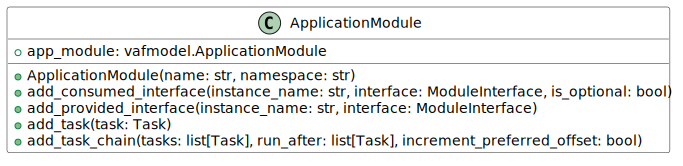
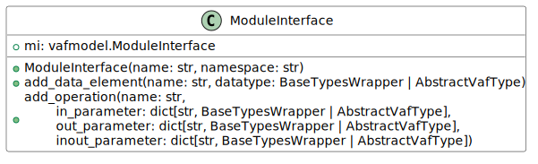
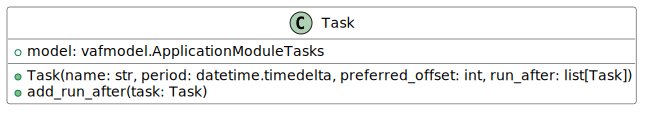

# Configuration

A code-based approach in Python is used to configure applications in the Vehicle Application
Framework (VAF). By default, there are two types of configuration levels, the foundation level
(using `vafmodel`) and the abstraction level (using `vafpy`). The user is encouraged to use the
abstraction level of the vafpy package, as this hides a lot of work that needs to be done to make
the internal runtime function. If more advanced features are needed, the vafmodel API still can be
used for customization.

## Abstraction level (vafpy)

The following section describes the classes in the vafpy package that are used to build a VAF
executable. To simplify the diagrams, only the vafpy-based parameters are shown in the method
descriptions. Each vafpy class supports full instantiation without the use of a convenience
function. For this, the constructor supports optional vafmodel-based parameters to instantiate the
classes. To allow advanced modifications, each vafpy object allows access to its internal
vafmodel instance.  

The following figure shows a simplified overview of the Configuration as Code (CaC)
architecture.

 

### Executable

Each VAF application consists of at least one executable. The executable contains an executor that
is responsible for scheduling the tasks of added application modules. The period of the executor and
the name of the executable are set in the constructor of this class.

Application modules can be added to an executable using the `add_application_module()` method. The
interfaces of the application modules must be bound to an appropriate counterpart. The executable
API provides several methods to bind interfaces to supported platforms.  

 

### Application Module

An application module is the entity in which the business logic is implemented by the user. Each
application module has a unique name in its namespace and can be added to multiple executables. To
communicate with other modules, module interfaces are used. Those can be added to the application
module as either provided or consumed interfaces. Consumed interfaces can be marked as optional,
which allows the application module to start before the a corresponding provider is available.

Tasks are used to execute the business logic functionality. They can be added to the application
module either individually or as a task chain. The latter ensures that the tasks are executed in a
specific order.

 

### Module Interface

A module interface is an interface description. It contains data elements and operations; the name
must be unique in the specified namespace. Module interfaces can be reused across multiple
application modules. Custom datatypes for data elements and operations can be defined using the
classes in the `vafpy.datatypes` module.

 

### Task

Tasks defined in the CaC result in method stubs that are generated in the application module code.
Their names must be unique for each executable. The period parameter defines the period cycle in
which the method is called. The `referred_offset` parameter allows the user to specify a task order
to be used when tasks have the same period.

 

### Datatypes

If custom datatypes are needed in module interfaces, they can be created in the CaC. The supported
datatypes are shown in the following figure. A `TypeRef` is implemented as a `using` statement in
the generated C++ code.

 
