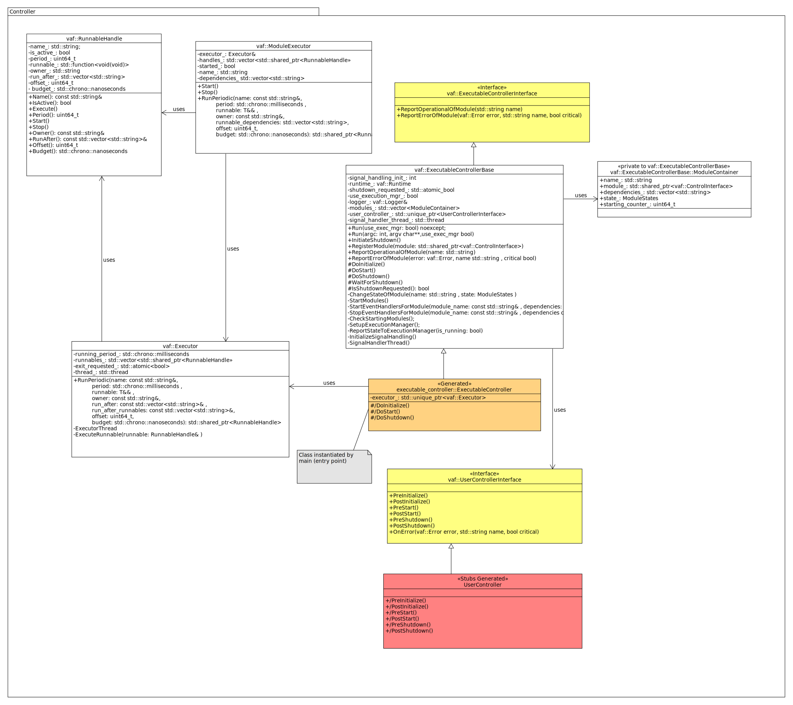
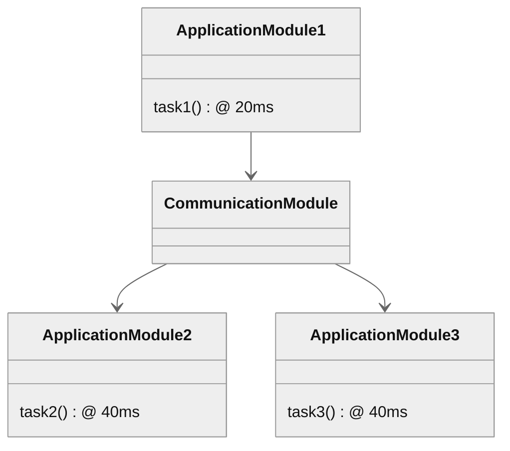
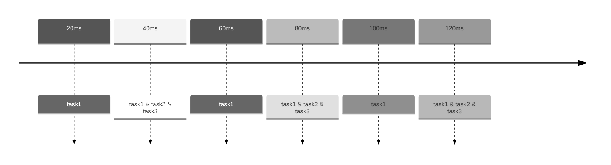
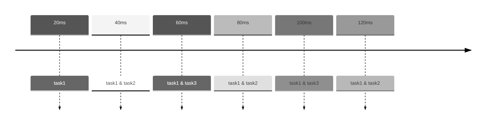
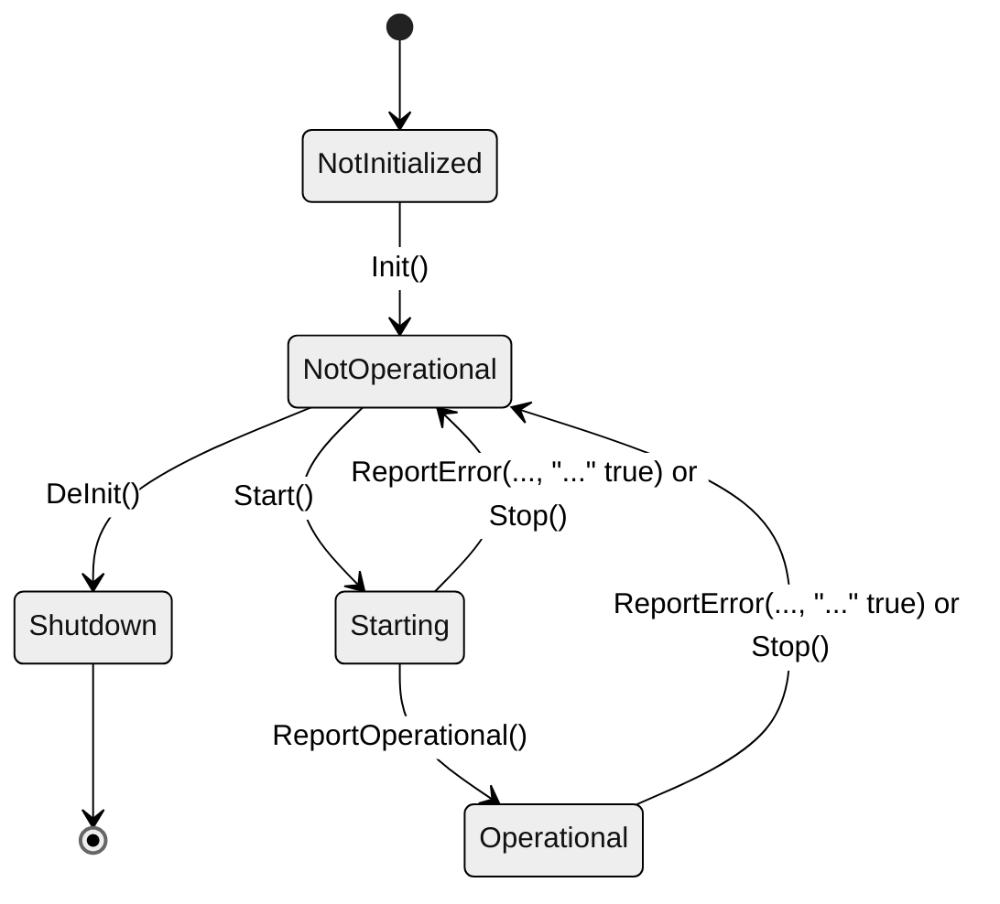
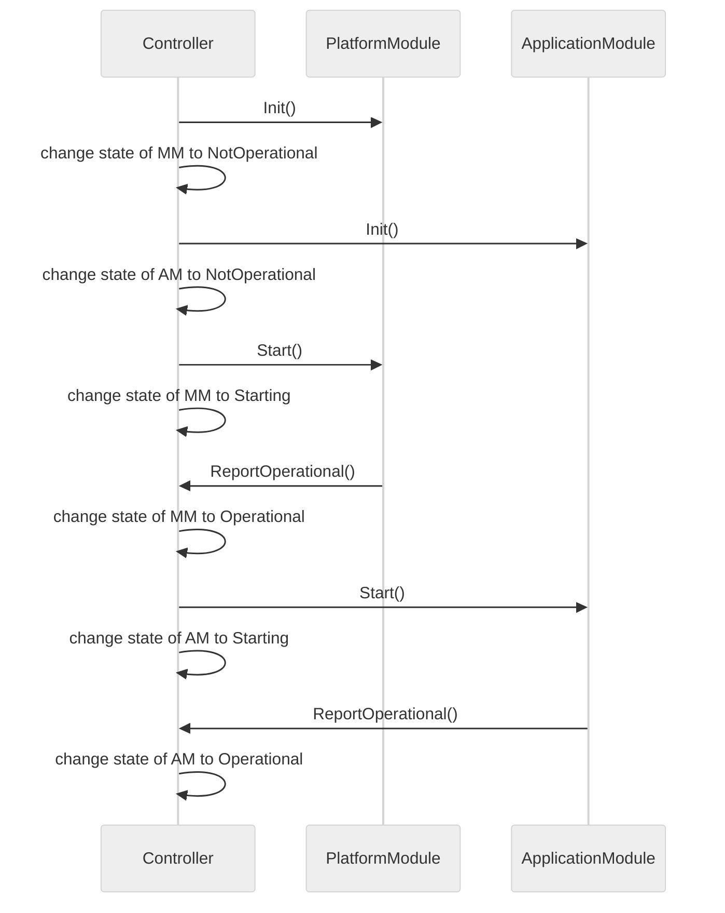
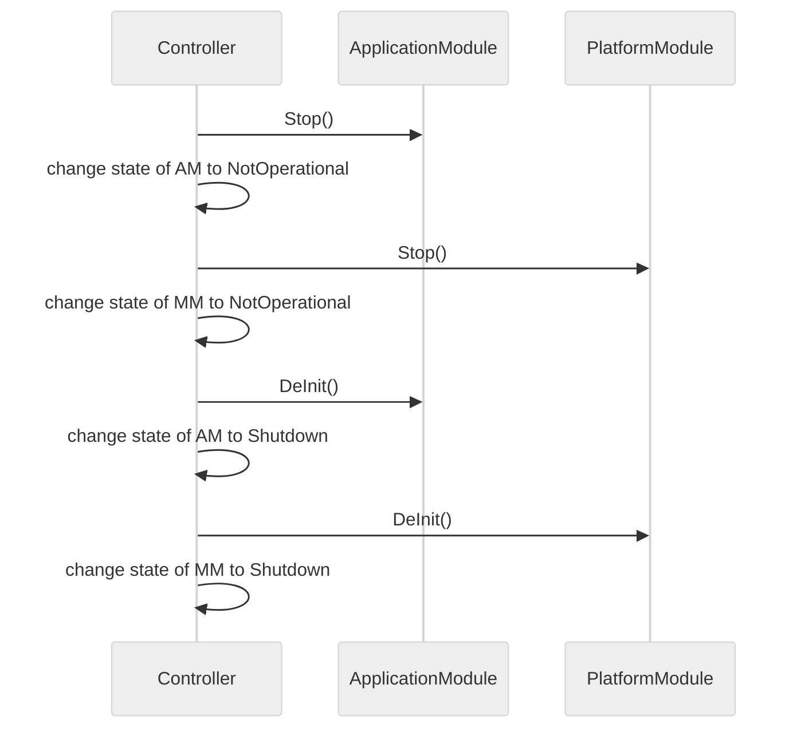
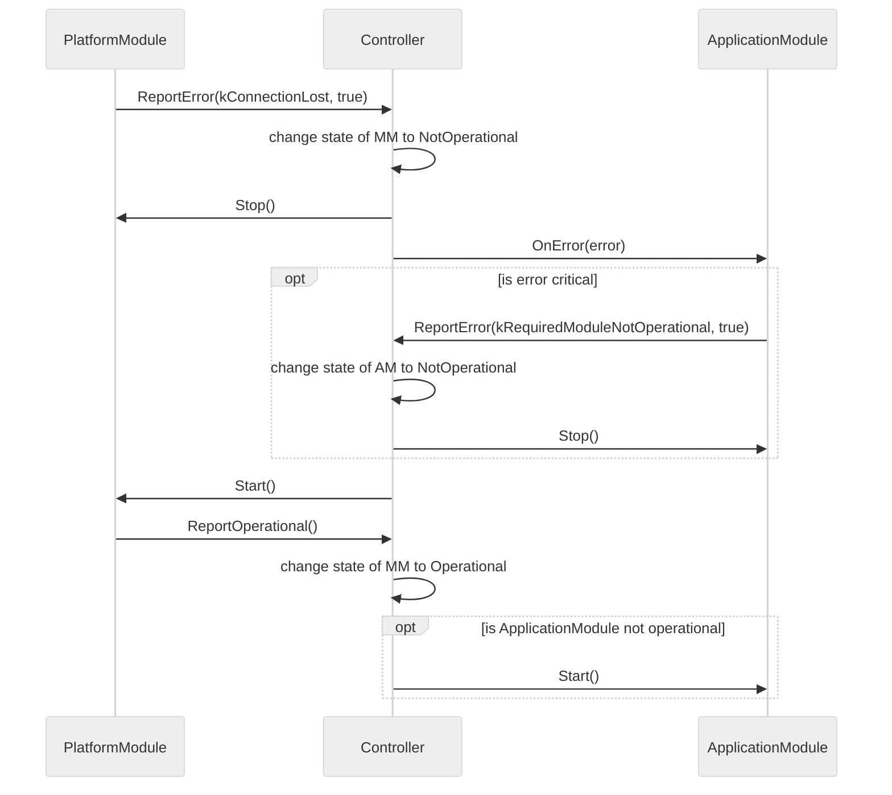

# VAF software library (vafcpp)

The vafcpp library is the core library and static code part of the Vehicle Application Framework
(VAF). It covers abstraction of required primitives such as future, promise, data pointer, error,
and logging. Beyond that, it contains the basic framework for the execution of application and
platform communication modules. The execution framework is mainly divided into an executor (see
[executor.h](../../SwLibraries//vaf_core_library/lib/include/vaf/executor.h)) and an executable
controller class (see
[executable_controller_base.h](../../SwLibraries/vaf_core_library/lib/include/vaf/executable_controller_base.h)).

An instance of the executable controller class is created in the main function of every VAF
executable, where it acts as entry point for execution. An instance of the executor class, which
manages the periodic execution of the tasks of application and communication modules, is a direct
member of this executable controller. All tasks that shall be scheduled by an executor are
accessible via so-called task handles. All tasks of one module are linked to a corresponding module
executor. The overall structure of the executor and executable controller is given below:

 

## Executor

The executor ensures periodic task execution (see
[executor.h](../../SwLibraries/vaf_core_library/lib/include/vaf/executor.h)). The period can be
configured with the *ExecutorPeriod* parameter in the executable configuration. Tasks are processed
while considering module dependencies. That is, if an application module A depends from application
module B, the tasks of module B are always executed before the ones of module A in one time slot.
Since the executor works with time slots, it maps the tasks deterministically into the same slot. To
avoid situations, where many tasks are mapped to the same time slot, it is possible to configure
tasks with an offset.

## Runtime monitoring

Each task can have a budget assigned to it. The executor will monitor the execution time of a
task and log any violation of its budget. Also the runtime of the executor time slot is monitored
and if tasks in one slot exceed their budget, a warning is logged.

**Example**

Consider the example with three application modules with one task each and an executor period of
20ms (see figure below).

Every second cycle, the executor has to execute all three tasks in one time slot. For a better load
distribution, one can add an offset of 1 (cycle) to task3 as depicted in the next figure.

## Future/Promise

The abstraction of *Future* and *Promise* primitives is encapsulated by the `vaf::Future` and
`vaf::Promise` namespaces respectively. For details see
[future.h](../../SwLibraries/vaf_core_library/lib/include/vaf/future.h).

## Data pointer

Two types of data pointers are used in VAF. First one is `vaf::DataPtr`, a data pointer type where
the data can be changed. Second one is `vaf::ConstDataPtr`, where the data is fixed. The underlying
type of a `vaf::DataPtr` or a `vaf::ConstDataPtr` is not fixed. For the `vaf::DataPtr` case the
underlying type can be a platform-specific type, for example `std::unique_ptr`. Same holds for the
`vaf::ConstDataPtr` case, which also maps to `std::unique_ptr` for example. See
[data_ptr.h](../../SwLibraries/vaf_core_library/lib/include/vaf/data_ptr.h) for the details.

## Error

The abstraction of error codes, i.e., `vaf::Error`, is implemented in
[error_domain.h](../../SwLibraries/vaf_core_library/lib/include/vaf/error_domain.h).

### Error reporting

Modules can report errors via `ReportError(ErrorCode error_code, std::string msg, bool critical = false)`. See 
[controller_interface.h](../../SwLibraries/vaf_core_library/lib/include/vaf/controller_interface.h).
If `critical` is set to *true*, the state of the module changes to *not operational*. Errors are
further propagated to other modules that depend on the module in question.

## ExecutableController

The executable controller manages the states of the application and communication modules (see
[executable_controller_base.h](../../SwLibraries/vaf_core_library/lib/include/vaf/executable_controller_base.h)).  
The following state machine defines the *states and *state transitions* of a module:

The following methods trigger a ***state transition***:
- Init()
  - Called at startup.
- DeInit()
  - Called at shutdown.
- Start()
  - Called when all required modules are operational.
  - Will enable executor tasks.
- Stop()
  - Called when the module reports an error or before shutdown.
  - Will disable executor tasks and receive handlers.
- ReportOperational()
  - Called by the module, if starting was successful or an error was recovered.
  - Will enable receive handler.
- ReportError(..., "..." true)
  - Called if the module detects an error (makes the module unusable for other modules).
  - Will disable executor tasks and receive handlers.
  - Will call OnError() on all modules that depend on the module.
  
The following sequence diagram shows the ***startup*** of communication and application modules by
the executable controller:

The following sequence diagram shows the ***shutdown*** of platform and application modules by
the executable controller:

The following sequence diagram shows the ***normal operation*** of platform and application
modules in interaction with the executable controller:

## Logging

Logging functionality is encapsulated by the `vaf::Logger` namespace. For details see
[logging.h](../../SwLibraries/vaf_core_library/lib/include/vaf/logging.h).
